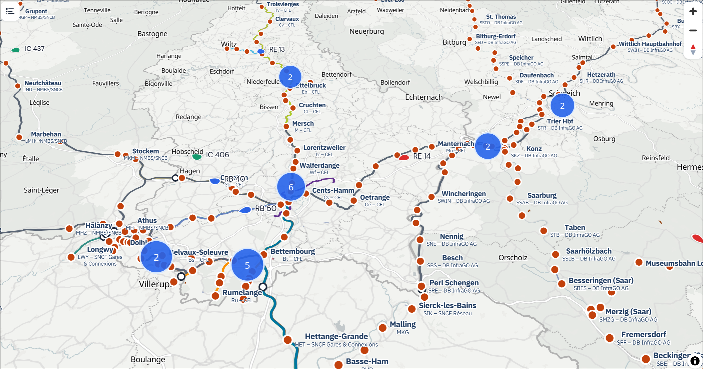

<div align="center">
    
    <p><em>real-time train tracking map this component was originally built for</em></p>
</div>

[](https://github.com/Spillgebees/Blazor.Map/actions/workflows/build-and-test.yml)
[](https://www.nuget.org/packages/Spillgebees.Blazor.Map)
[](https://www.nuget.org/packages/Spillgebees.Blazor.Map)
[](https://spillgebees.github.io/Blazor.Map)
[](LICENSE)

`Spillgebees.Blazor.Map` is a Blazor map component powered by [MapLibre GL JS](https://maplibre.org/).

See the [documentation and demos](https://spillgebees.github.io/Blazor.Map) for guides, examples, and live components.

## Features

- Declarative Blazor API for sources, layers, markers, shapes, popups, controls, and overlays
- Performant entity tracking with smooth animation, clustering, decorations, and interactivity
- Composable map styles: multiple base styles, raster/WMS overlays, light/dark themes

## Quick example

```razor
<SgbMap Center="@(new Coordinate(49.6117, 6.1319))"
        Zoom="12"
        Style="@MapStyle.OpenFreeMap.Liberty"
        Height="400px"
        Width="100%">
    <MapControls>
        <NavigationMapControl />
        <ScaleMapControl />
    </MapControls>

    <MapSources>
        <GeoJsonSource Id="railway" Data="@_railwayGeoJson">
            <LineLayer Id="tracks" Color="@("#475569")" Width="2" />
        </GeoJsonSource>
    </MapSources>

    <MapFeatures>
        <MapMarker Id="luxembourg-city"
                   Position="@(new Coordinate(49.6117, 6.1319))"
                   Title="Luxembourg City"
                   Popup="@_luxembourgPopup" />
    </MapFeatures>
</SgbMap>

@code {
    private readonly string _railwayGeoJson = """
        {
            "type": "FeatureCollection",
            "features": [
                {
                    "type": "Feature",
                    "properties": {},
                    "geometry": {
                        "type": "LineString",
                        "coordinates": [
                            [6.1290, 49.5895],
                            [6.1334, 49.6006],
                            [6.1365, 49.6112],
                            [6.1330, 49.6219]
                        ]
                    }
                }
            ]
        }
        """;

    private readonly PopupOptions _luxembourgPopup = PopupOptions.FromText("Luxembourg City");
}
```
